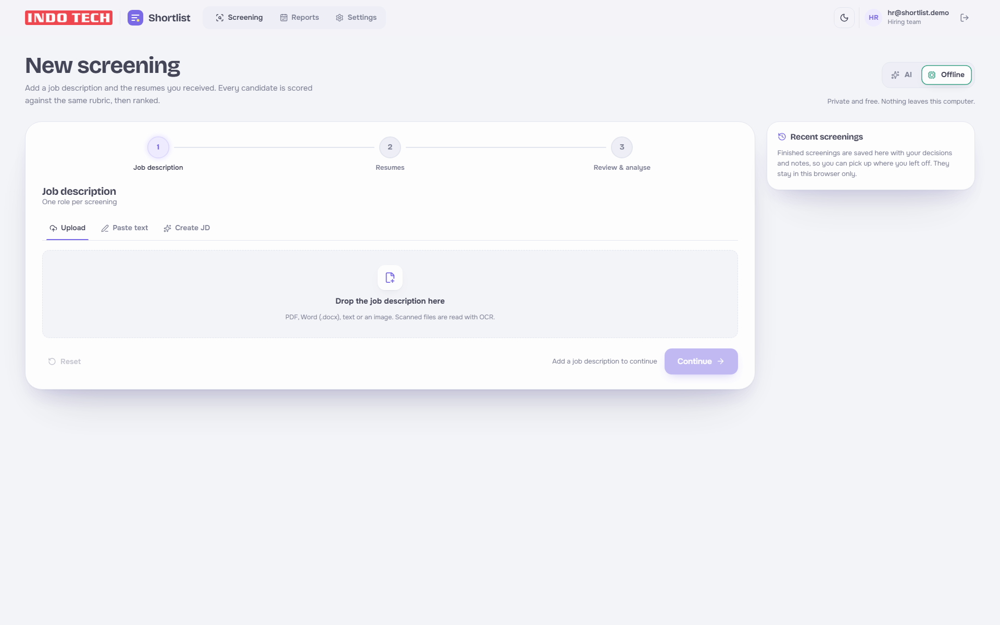
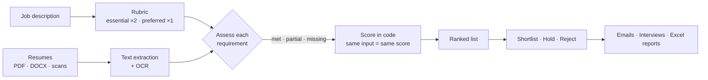
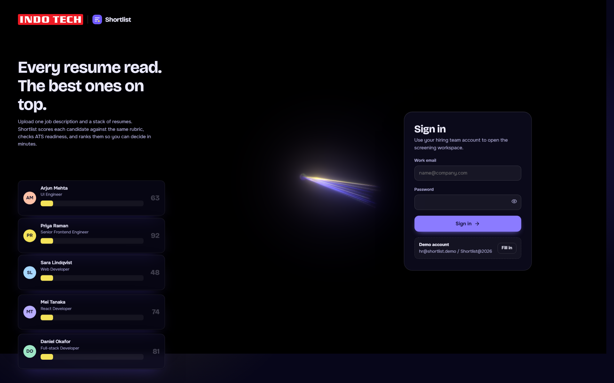

<div align="center">


# Job Lens

### Every resume read. The best ones on top.

**Resume screening for the Indo Tech Transformers Limited hiring team.**
Upload one job description and a stack of resumes. Job Lens scores every candidate against the same rubric, checks ATS readiness, and ranks them so HR can decide in minutes, not days.

[](https://krishna-ittl.github.io/Job-Lens/)


<br />



</div>

---

## Why Job Lens

| | |
|---|---|
| **Fair** | Every resume is judged on one rubric built from the JD. Essentials count double. The score is calculated in code, so the same inputs always give the same score. |
| **Fast** | Drop 100 resumes (PDF, Word, scans, photos) and get a ranked list with fit summaries, matched skills and missing essentials. |
| **Private** | Offline mode runs entirely in the browser. No key, no cost, nothing uploaded. |
| **Made for HR** | Shortlist, hold or reject; schedule interviews; send templated emails; export clean Excel reports with the company logo. |

## Features

**Screening**
- 📝 **Job description**: upload, paste, or **Create JD** with Indo Tech Transformers Limited as the default company. There are templates for transformer design, testing, quality, production, service and commissioning, tender sales, purchase and projects, plus corporate roles. Set the department, seniority, openings, qualification, must-have skills, salary, work mode and working conditions.
- 📄 **Resumes**: any number of PDF, .docx, text or image files. Scanned files are read with OCR in the browser.
- 🎯 **Ranking**: match score (0–100), ATS readiness, evidence for each requirement, strengths, concerns and suggested interview questions.
- 🔁 **Two engines**: **AI** (Claude, ChatGPT or Gemini, with your own key) or **Offline** (skills matching plus a small on-device language model, about 23 MB, cached after the first use).

**After the ranking**
- ✅ **Decisions**: Shortlist, Hold or Reject, private notes for each candidate, and search and filters.
- 📅 **Interviews**: date, format and link or address, and **Add to calendar** (.ics for Outlook or Google Calendar).
- ✉️ **Email templates**: invite, keep-warm and regret emails with the name, role and interview time filled in. Send to one candidate or a whole group (BCC). Edit the templates in Settings.
- 👥 **Contacts**: email, phone, LinkedIn, GitHub and portfolio pulled from each resume, grouped by decision.
- ⚖️ **Compare**: 2 or 3 candidates side by side, requirement by requirement.
- 🧬 **Duplicate detection**: the same person twice in a batch, or someone who applied before (with the earlier role and decision).
- 📊 **Statistics**: pipeline counts, score distribution, decision split and the most common skill gaps.

**Reporting**
- 📗 **Excel report per screening**: the Indo Tech logo, a Summary sheet (received, screened, shortlisted, on hold, rejected, averages, requirement coverage), and one sheet each for Shortlisted, On hold, Rejected, Undecided and All candidates.
- 🗓️ **Monthly report**: totals across every screening in a month, by role, with interviews and shortlisted candidates, downloadable as Excel.
- 🕘 **Recent screenings**: every finished run is saved with its decisions, notes and interviews, and reopens in one click.

## How it works



The model (AI or offline) only labels each requirement as **met**, **partial** or **missing**, with evidence. The number is calculated from a fixed weighting, and AI results are cached by a hash of the model, JD and resume.

## Screenshots

<table>
  <tr>
    <td></td>
    <td></td>
  </tr>
  <tr>
    <td align="center">Sign in</td>
    <td align="center">Full-width workspace with recent screenings</td>
  </tr>
</table>

## Quick start

```bash
npm install
npm run dev          # http://localhost:5173
```

Demo login: `hr@shortlist.demo` / `Shortlist@2026`

```bash
npm run build          # static site in dist/, host anywhere
npm run check          # rubric maths, parsing, contact extraction
npm run check:jd       # Create JD templates and which sections are scored
npm run check:hr       # email templates, calendar files, duplicates, monthly totals
npm run check:excel    # builds both Excel reports from sample resumes and reads them back
npm run check:offline  # offline engine with the real model (downloads ~23 MB once)
```

Every push to `main` runs the checks and deploys to GitHub Pages (`.github/workflows/deploy.yml`).

## Privacy and limits

- **Offline mode** sends nothing anywhere. **AI mode** sends the JD and resume text straight from the browser to the provider you chose, using your own key. Keys are kept only in this browser.
- Screenings, decisions, notes and interviews are stored **in this browser only**. Clearing browser data removes them, and colleagues do not see each other's screenings. A shared database is the next step for team use.
- The login is a demo gate, not real authentication. For a public deployment, put a small server in front that holds the API key and handles sign-in.
- Old `.doc` files are not supported; save them as `.docx` or PDF.

## Tech stack

React 19 · TypeScript · Vite · Motion · pdf.js · mammoth · Tesseract.js (OCR) · Transformers.js (all-MiniLM, on-device) · ExcelJS · Anthropic, OpenAI and Gemini APIs

<div align="center">
<br />
<sub>Built for <a href="https://www.indo-tech.com/">Indo Tech Transformers Limited</a> · Your Reliable Partner For Sustainable Future</sub>
</div>
